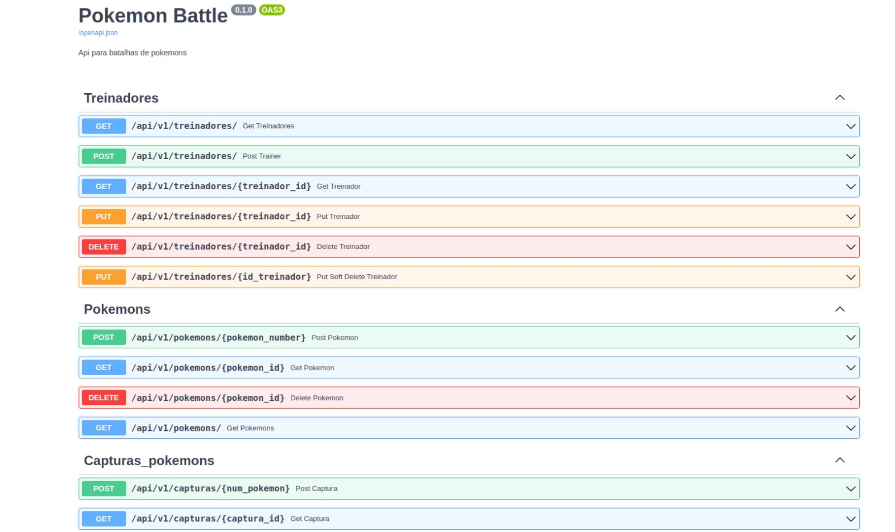
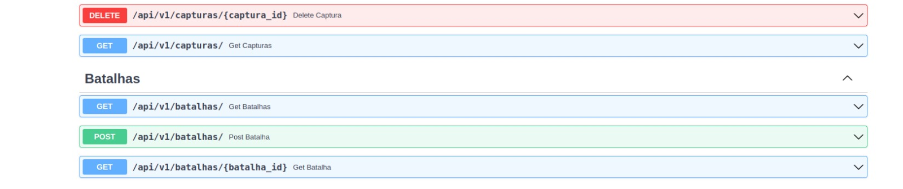

# Projeto Pokemon Battle

Nesse repositório contém um projeto realizado com python assíncrono, o framework
FastAPI, e a api pública de pokemons https://pokeapi.co/

O projeto consiste em um sistema de batalhas de pokemons, onde foi desenvolvida 
rotas separadas para cada caso.

exemplos:

- Rotas para treinadores (CRUD)
- Rotas para pokemons (CRUD)
- Rotas para captura de pokemons, onde um treinador já cadastrado consegue capturar um pokemon
fazendo um request da api de pokemons(CRUD)
- Rotas para o resultado das batalhas (LOGS)
### Pré-requisitos

- Python
- O banco de dados é de sua escolha, mas nesse projeto utilizei o PostgreSQL e a lib sqlalchemy
- Instalação dos requeriments.txt disponibilizados

###  Execução

Basta entrar no diretório do projeto e no terminão digitar python main.py

### Exemplos das rotas criadas:

